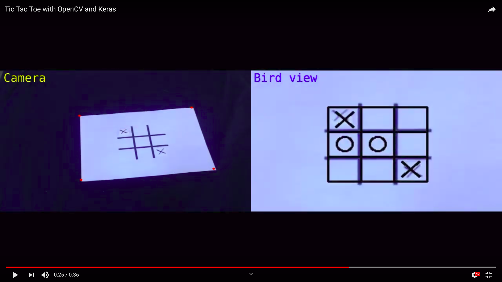
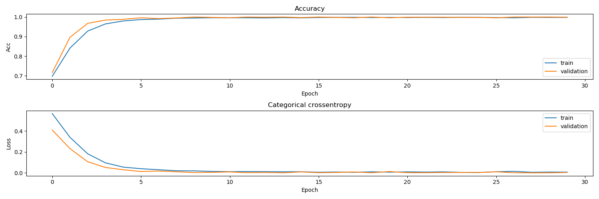

# Play tic-tac-toe with OpenCV and Keras
This project is about the traditional game of tic-tac-toe. Using OpenCV and Keras we are now able to play it
against the computer using a real board and a marker.

## Requirements
- Sheet of paper
- Black marker
- USB camera to stream video feed directly to the computer

## Guide
- Make sure the red dots are on each corner of the sheet of paper.
- It is recommendable to not completely cover the center cell.

## How to win?
Since the computer uses the [alphabeta algorithm](https://en.wikipedia.org/wiki/Alpha%E2%80%93beta_pruning), it is
guaranteed the game will end up being a draw or a win for the computer. You can see how the algorithm works by running
the *alphabeta.py* script. Have fun!

## Inner workings of the classification model

I used a simple Convolutional Neural Network to detect for each cell in the grid
whether there's an X, O or nothing. It has an average score of 0.9691 ± 0.0097.
It was trained ten times to make sure it had acceptable results.

This image shows that the model converges approximately on epoch 15. It appears
that the model has an accuracy greater than 0.96, but when evaluated on the test
set it achieved lower performance.

One possible explanation for the overfitting might be due to:
1. **Limited dataset:** even though the model is small, the dataset consists
of 160 images per class for training and validation, and 40 images per class
for evaluation. More data will yield better results.
2. **Evaluation data comes from a different distribution:** In order to obtain
the data, I used two sessions: one for training and validation data, and the
other one for evaluation. Since I didn't use a strict methodology, it is
**very** possible that the evaluation data  comes from a distribution the model
partially learned.

Nevertheless, I haven't had any misclassifications errors while playing
tic-tac-toe. Needless to say that these problems will be addressed in the
future just to make sure this project runs seamlessly.

## Resources
I used [CWoebker's alphabeta script](https://cwoebker.com/posts/tic-tac-toe) and added some documentation to it.
